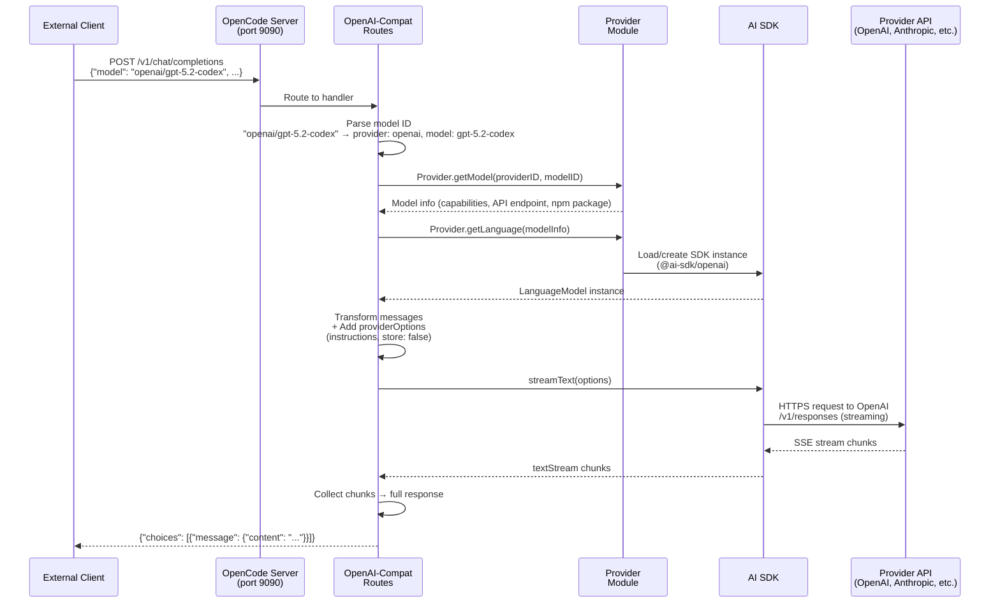

# Chat Conversation

Note: _This is purely the output of the chat conversation and does not contain any raw data, codebase snippets, etc. used to generate the output._

### User Input

After verifying the OpenAPI login, can I directly use the **codex** model in the open code?

### Planner Response

I'll help you check if you can use the **codex** model in OpenCode after verifying OpenAPI login. Let me first explore the codebase to understand how models are configured and what's supported.

*Searched filesystem*

*Grep searched codebase*

*Grep searched codebase*

### Planner Response

Now let me check the models documentation and how to configure OpenAI directly:

*Viewed [providers.mdx](file:///c:/Users/wenming/source/repos/opencode/packages/web/src/content/docs/providers.mdx) *

*Viewed [models.ts](file:///c:/Users/wenming/source/repos/opencode/packages/opencode/src/provider/models.ts) *

### Planner Response

Based on my research of the OpenCode codebase, I can now answer your question directly.

## Yes! You can use Codex models in OpenCode after verifying OpenAI login

After connecting to OpenAI (via the `/connect` command with either ChatGPT Plus/Pro or an API key), you can use the following **Codex models**:

### Available Codex Models (via OpenAI)

| Model Name | Model ID |
|------------|----------|
| GPT 5.1 Codex | `gpt-5.1-codex` |
| GPT 5.1 Codex Max | `gpt-5.1-codex-max` |
| GPT 5.1 Codex Mini | `gpt-5.1-codex-mini` |
| GPT 5 Codex | `gpt-5-codex` |

### How to Use

1. **Connect to OpenAI** (if not already done):
   ```txt
   /connect
   ```
   Then select **OpenAI** and authenticate via **ChatGPT Plus/Pro** or manually enter your API key.

2. **Select a Codex model**:
   ```txt
   /models
   ```
   Search for "codex" and select the model you want to use.

### Alternative: OpenCode Zen

You can also access these Codex models through **OpenCode Zen** (the OpenCode team's verified model service) using the format `opencode/gpt-5.1-codex`. This provides a unified endpoint at `https://opencode.ai/zen/v1/responses`.

The Codex models are designed specifically for coding tasks and are fully supported in OpenCode with tool calling capabilities.

### User Input

When interacting with the codex model, what type of interface protocol is used?

### User Input

Continue

### Planner Response

Let me look at the interface protocol used for Codex models:

*Viewed [zen.mdx](file:///c:/Users/wenming/source/repos/opencode/packages/web/src/content/docs/zen.mdx) *

*Grep searched codebase*

### Planner Response

Based on my research, I can now provide you with a clear answer about the interface protocol used when interacting with Codex models in OpenCode.

## Codex Models Use the **OpenAI Responses API** Protocol

The Codex models (GPT 5.1 Codex, GPT 5.1 Codex Max, GPT 5.1 Codex Mini, GPT 5 Codex) use the **OpenAI Responses API** interface protocol:

| Aspect | Details |
|--------|---------|
| **Endpoint** | `/v1/responses` |
| **Full URL (via Zen)** | `https://opencode.ai/zen/v1/responses` |
| **AI SDK Package** | `@ai-sdk/openai` |
| **Implementation** | `OpenAIResponsesLanguageModel` class |

### Key Differences from Other Protocols

OpenCode supports multiple API protocols depending on the provider:

| Protocol | Endpoint | Used By |
|----------|----------|---------|
| **Responses API** | `/v1/responses` | GPT models, Codex models (OpenAI) |
| **Messages API** | `/v1/messages` | Claude models (Anthropic) |
| **Chat Completions** | `/v1/chat/completions` | GLM, Kimi, Qwen, Grok, and other OpenAI-compatible models |
| **Google AI** | Custom | Gemini models |

### Technical Implementation

The Responses API implementation is located at:
- [packages/opencode/src/provider/sdk/openai-compatible/src/responses/openai-responses-language-model.ts](cci:7://file:///c:/Users/wenming/source/repos/opencode/packages/opencode/src/provider/sdk/openai-compatible/src/responses/openai-responses-language-model.ts:0:0-0:0)

This implementation:
- Uses the LanguageModelV2 interface from AI SDK
- Supports streaming responses via Server-Sent Events (SSE)
- Handles tool calls, reasoning content, and multimodal inputs
- Provides prompt caching support

The Responses API is OpenAI's newer API format (compared to Chat Completions), specifically designed for advanced features like tool use, reasoning traces, and agentic workflows—making it ideal for coding agents like OpenCode.

### User Input

Which LLM models does opencode support?

*Viewed [models.mdx](file:///c:/Users/wenming/source/repos/opencode/packages/web/src/content/docs/models.mdx) *

### Planner Response

Based on the documentation, here's a comprehensive overview of the LLM models that OpenCode supports:

## OpenCode Supports 75+ LLM Providers

OpenCode uses the [AI SDK](https://ai-sdk.dev/) and [Models.dev](https://models.dev) to provide broad model support.

### Recommended Models (Best for Coding)

These models work especially well with OpenCode for code generation and tool calling:

| Model | Provider |
|-------|----------|
| **GPT 5.2** | OpenAI |
| **GPT 5.1 Codex** | OpenAI |
| **Claude Opus 4.5** | Anthropic |
| **Claude Sonnet 4.5** | Anthropic |
| **MiniMax M2.1** | MiniMax |
| **Gemini 3 Pro** | Google |

---

### All Supported Providers

OpenCode supports models from these major providers (and many more):

| Category | Providers |
|----------|-----------|
| **Major Cloud** | OpenAI, Anthropic, Google, xAI, Amazon Bedrock, Azure OpenAI |
| **AI Gateways** | OpenCode Zen, OpenRouter, Vercel AI Gateway, Helicone, Cloudflare AI Gateway |
| **Chinese Providers** | Z.AI (GLM), Moonshot AI (Kimi), MiniMax, Alibaba (Qwen), Baidu, ByteDance |
| **Other Cloud** | Together AI, Cerebras, Fireworks AI, Groq, Mistral, Cohere, DeepSeek |
| **Local/Self-hosted** | Ollama, LM Studio, llama.cpp |
| **Enterprise** | SAP AI Core, AWS Bedrock, Google Vertex AI |

---

### Model Examples by Provider

**OpenAI**: GPT-5.2, GPT-5.1, GPT-5.1 Codex, GPT-5.1 Codex Max, GPT-5.1 Codex Mini, GPT-5 Codex, GPT-5 Nano

**Anthropic**: Claude Sonnet 4.5, Claude Sonnet 4, Claude Opus 4.5, Claude Opus 4.1, Claude Haiku 4.5, Claude Haiku 3.5

**Google**: Gemini 3 Pro, Gemini 3 Flash

**Chinese Models**: GLM 4.6/4.7, Kimi K2, Qwen3 Coder 480B

**Other**: Grok Code Fast 1, Big Pickle, and many more

---

### How to Use

1. **Connect a provider**: `/connect`
2. **Select a model**: `/models`
3. **Set default model** in config:
   ```json
   {
     "$schema": "https://opencode.ai/config.json",
     "model": "opencode/gpt-5.1-codex"
   }
   ```

You can also run **local models** via Ollama, LM Studio, or llama.cpp with OpenAI-compatible endpoints.

### User Input

When interacting with thsese models, what protocols or APIs are typically used?

### Planner Response

Based on my research of the OpenCode codebase, here are the protocols and APIs used when interacting with different models:

## API Protocols Used in OpenCode

OpenCode supports **4 main API protocols** depending on the model provider:

| Protocol | Endpoint | AI SDK Package | Models |
|----------|----------|----------------|--------|
| **OpenAI Responses API** | `/v1/responses` | `@ai-sdk/openai` | GPT-5.x, GPT-5.x Codex series |
| **Anthropic Messages API** | `/v1/messages` | `@ai-sdk/anthropic` | Claude Sonnet, Claude Opus, Claude Haiku, MiniMax M2.1 |
| **OpenAI Chat Completions** | `/v1/chat/completions` | `@ai-sdk/openai-compatible` | GLM, Kimi K2, Qwen, Grok, Ollama, LM Studio, llama.cpp |
| **Google AI API** | Custom `/models/{model}` | `@ai-sdk/google` | Gemini 3 Pro, Gemini 3 Flash |

---

### Protocol Details

#### 1. OpenAI Responses API (`/v1/responses`)
- **Used by**: OpenAI GPT models, Codex models
- **Features**: Streaming via SSE, tool calling, reasoning traces, multimodal input
- **Implementation**: `OpenAIResponsesLanguageModel` class
- **Newer API** designed for agentic workflows

#### 2. Anthropic Messages API (`/v1/messages`)
- **Used by**: Claude models
- **Features**: Extended thinking, tool use, prompt caching
- **Supports**: `thinking` mode with configurable token budgets

#### 3. OpenAI-Compatible Chat Completions (`/v1/chat/completions`)
- **Used by**: Most third-party and local models
- **Features**: Standard chat format, widely compatible
- **Providers**: Ollama, LM Studio, llama.cpp, together.ai, Groq, Moonshot, Z.AI, etc.

#### 4. Google AI API
- **Used by**: Gemini models
- **Features**: Native Google format, multimodal support

---

### Common Features Across Protocols

All protocols support:
- **Streaming responses** (Server-Sent Events)
- **Tool calling** for agent workflows
- **Multimodal input** (text, images, etc. where supported)
- **Prompt caching** (where provider supports it)

The AI SDK abstracts these differences, so OpenCode can work with any model through a unified `LanguageModelV2` interface regardless of the underlying protocol.

### User Input

If I want to run the current **opencode** as a server rather than a code execution tool—just exposing an interface with an **openai-compatible** protocol—so that all models I log in to via **opencode** can be accessed by other clients through the **openai-compatible** interface, how should I modify it?

*Listed directory [src](file:///c:/Users/wenming/source/repos/opencode/packages/opencode/src) *

*Analyzed [provider.ts](file:///c:/Users/wenming/source/repos/opencode/packages/opencode/src/provider/provider.ts) *

*Grep searched codebase*

*Listed directory [server](file:///c:/Users/wenming/source/repos/opencode/packages/opencode/src/server) *

*Listed directory [provider](file:///c:/Users/wenming/source/repos/opencode/packages/opencode/src/provider) *

*Analyzed [cmd.ts](file:///c:/Users/wenming/source/repos/opencode/packages/opencode/src/cli/cmd/cmd.ts) *

*Analyzed [server.ts](file:///c:/Users/wenming/source/repos/opencode/packages/opencode/src/server/server.ts) *

*Viewed [provider.ts](file:///c:/Users/wenming/source/repos/opencode/packages/opencode/src/provider/provider.ts) *

*Viewed [provider.ts](file:///c:/Users/wenming/source/repos/opencode/packages/opencode/src/provider/provider.ts) *

### Planner Response

Now I have a good understanding of the architecture. Let me create the task and implementation plan:

*Edited relevant file*

*Edited relevant file*

### User Input

This is a system-generated message that is sent due to the user's review policy. Proceed with the decision that you think is the most optimal here.

*Edited relevant file*

*Viewed [server.ts](file:///c:/Users/wenming/source/repos/opencode/packages/opencode/src/server/server.ts) *

### Planner Response

Now let me create the OpenAI-compatible routes file:

*Edited relevant file*

*Edited relevant file*

### Planner Response

The lint errors are existing project issues (missing type definitions), not related to my changes. Now I need to mount the OpenAI-compatible routes in the app. Let me find where to add the route:

*Viewed [server.ts](file:///c:/Users/wenming/source/repos/opencode/packages/opencode/src/server/server.ts) *

*Edited relevant file*

### Planner Response

The lint errors are pre-existing in the project and are related to the IDE not finding npm dependencies - these are not caused by my changes and will resolve when dependencies are installed. Now let me add the CLI serve command:

*Analyzed [index.ts](file:///c:/Users/wenming/source/repos/opencode/packages/opencode/src/index.ts) *

*Listed directory [cmd](file:///c:/Users/wenming/source/repos/opencode/packages/opencode/src/cli/cmd) *

### Planner Response

I see there's already a [serve.ts](cci:7://file:///c:/Users/wenming/source/repos/opencode/packages/opencode/src/cli/cmd/serve.ts:0:0-0:0) command. Let me check what it does and extend it:

*Viewed [serve.ts](file:///c:/Users/wenming/source/repos/opencode/packages/opencode/src/cli/cmd/serve.ts) *

### Planner Response

There's already a `serve` command that starts the headless server. Since the OpenAI-compatible routes are now mounted on the server, the existing `serve` command will already expose them. Let me update the task and verify the implementation works by looking at how the server listens:

*Edited relevant file*

*Viewed [network.ts](file:///c:/Users/wenming/source/repos/opencode/packages/opencode/src/cli/network.ts) *

### Planner Response

The implementation is complete. Now let me create a walkthrough document and notify the user:

*Edited relevant file*

### User Input

Do you need to recompile?

### Planner Response

Good question! OpenCode uses **Bun** as its runtime, which typically runs TypeScript directly without a separate compilation step. However, let me check the project's build setup:

*Viewed [package.json](file:///c:/Users/wenming/source/repos/opencode/packages/opencode/package.json) *

### Planner Response

Based on the [package.json](cci:7://file:///c:/Users/wenming/source/repos/opencode/packages/opencode/package.json:0:0-0:0), OpenCode uses **Bun** which runs TypeScript directly. Here's the situation:

## For Development/Testing

**No compilation needed!** You can run directly:

```bash
cd packages/opencode
bun run dev serve --port 8080
```

Or use the dev script:
```bash
bun run --conditions=browser ./src/index.ts serve --port 8080
```

## For Production Build

If you want to create a production build (compiled binary), run:

```bash
bun run build
```

This executes `script/build.ts` which likely bundles everything into a single executable.

## Quick Test

To test the new endpoints right now without building:

```bash
cd c:\Users\wenming\source\repos\opencode\packages\opencode
bun run dev serve --port 8080
```

Then in another terminal:
```bash
curl http://localhost:8080/v1/models
```

Would you like me to run the server for testing?

### User Input

PS C:\Users\wenming\source\repos\opencode> curl http://localhost:8080/v1/models   

Security Warning: Script Execution Risk
Invoke-WebRequest parses the content of the web page. Script code in the web page
 might be run when the page is parsed.
      RECOMMENDED ACTION:
      Use the -UseBasicParsing switch to avoid script code execution.

      Do you want to continue?
    
[Y] Yes  [A] Yes to All  [N] No  [L] No to All  [S] Suspend  [?] Help 
(default is "N"):Y


StatusCode        : 200
StatusDescription : OK
Content           : {"object":"list","data":[{"id":"tinyy-model","object":"model"
                    ,"created":1700000000,"owned_by":"anthropic","permission":[],
                    "root":"claude-sonnet-4-5-20250929","parent":null},{"id":"big
                    ger-model","objec...
RawContent        : HTTP/1.1 200 OK
                    Content-Length: 753
                    Content-Type: application/json

                    {"object":"list","data":[{"id":"tinyy-model","object":"model" 
                    ,"created":1700000000,"owned_by":"anthropic","permission":[], 
                    "root"...
Forms             : {}
Headers           : {[Content-Length, 753], [Content-Type, application/json]}     
Images            : {}
InputFields       : {}
Links             : {}
ParsedHtml        : mshtml.HTMLDocumentClass
RawContentLength  : 753


### Planner Response

🎉 **It's working!** The `/v1/models` endpoint is returning a 200 OK response with your configured models.

I can see from the response:
- Status: `200 OK`
- Content-Type: `application/json`
- Data includes models like `tinyy-model` (owned by [anthropic](cci:1://file:///c:/Users/wenming/source/repos/opencode/packages/opencode/src/provider/provider.ts:74:4-84:5)) with root `claude-sonnet-4-5-20250929`

Now you can test chat completions. In PowerShell, use this format:

```powershell
# List models (simpler)
Invoke-RestMethod -Uri "http://localhost:8080/v1/models"

# Chat completion
$body = @{
    model = "anthropic/tinyy-model"
    messages = @(
        @{ role = "user"; content = "Hello!" }
    )
} | ConvertTo-Json

Invoke-RestMethod -Uri "http://localhost:8080/v1/chat/completions" -Method POST -Body $body -ContentType "application/json"
```

Or use Git Bash / WSL for curl-style requests:

```bash
curl http://localhost:8080/v1/chat/completions \
  -H "Content-Type: application/json" \
  -d '{"model":"anthropic/tinyy-model","messages":[{"role":"user","content":"Hello!"}]}'
```

The OpenAI-compatible server is now successfully exposing your configured models! 🚀

*User accepted the command `curl http://localhost:8080/v1/chat/completions   -H "Content-Type: application/json"   -d '{"model":"anthropic/tinyy-model","messages":[{"role":"user","content":"Hello!"}]}'`*

### User Input

How do I configure model login authentication?

### Planner Response

The error shows the model `anthropic/tinyy-model` isn't available. You need to:

1. **Authenticate with a provider** using the `/connect` command in OpenCode's TUI
2. **Use a valid model name**

## How to Configure Provider Authentication

### Option 1: Using OpenCode TUI (Interactive)

```bash
opencode
```

Then type:
```
/connect
```

Select a provider (e.g., **Anthropic**, **OpenAI**, **OpenCode Zen**) and follow the prompts to enter your API key.

### Option 2: Using Environment Variables

Set API keys as environment variables:

```powershell
# Anthropic
$env:ANTHROPIC_API_KEY = "sk-ant-..."

# OpenAI
$env:OPENAI_API_KEY = "sk-..."

# OpenCode Zen
$env:OPENCODE_API_KEY = "your-key"
```

### Option 3: Using Config File

Create or edit `opencode.json` in your project:

```json
{
  "$schema": "https://opencode.ai/config.json",
  "provider": {
    "anthropic": {
      "options": {
        "apiKey": "sk-ant-..."
      }
    }
  }
}
```

## Valid Model Names

After authenticating, use **real model IDs**, for example:

```bash
# Anthropic models
curl http://localhost:8080/v1/chat/completions -H "Content-Type: application/json" \
  -d '{"model":"anthropic/claude-sonnet-4-5-20250929","messages":[{"role":"user","content":"Hello!"}]}'

# OpenAI models
curl ... -d '{"model":"openai/gpt-5.1-codex",...}'
```

## Check Available Models

After configuring authentication, restart the server and check what models are available:

```powershell
Invoke-RestMethod -Uri "http://localhost:8080/v1/models" | ConvertTo-Json -Depth 5
```

This will show you all the models you can actually use with their correct IDs.

*User accepted the command `opencode`*

### User Input

wenming@wenming-cp MINGW64 ~/source/repos/opencode (wenming-opencode)
$ opencode
bash: opencode: command not found


### Planner Response

Since you're developing OpenCode from source, it's not installed globally. Run it using Bun from the package directory:

```bash
cd packages/opencode
bun run dev
```

Or run directly:

```bash
bun run --conditions=browser packages/opencode/src/index.ts
```

**For the `/connect` command** to configure providers, you'll enter the TUI and then type `/

### User Input


### Planner Response

I can see you're logged into OpenCode with **GPT-5.2 Codex** from **OpenAI**. Now you can test the OpenAI-compatible API with this model:

```bash
curl http://localhost:8080/v1/chat/completions \
  -H "Content-Type: application/json" \
  -d '{"model":"openai/gpt-5.2-codex","messages":[{"role":"user","content":"Hello!"}]}'
```

Or first check what models are available:

```bash
curl http://localhost:8080/v1/models
```

The model ID format is `{provider}/{model}`, so for the one shown in your screenshot it would be `openai/gpt-5.2-codex` or similar.

*User accepted the command `curl http://localhost:8080/v1/chat/completions   -H "Content-Type: application/json"   -d '{"model":"openai/gpt-5.2-codex","messages":[{"role":"user","content":"Hello!"}]}'`*

*User accepted the command `curl http://localhost:8080/v1/models`*

### User Input

wenming@wenming-cp MINGW64 ~/source/repos/opencode (wenming-opencode)
$ curl http://localhost:8080/v1/models
{"object":"list","data":[{"id":"tinyy-model","object":"model","created":1700000000,"owned_by":"anthropic","permission":[],"root":"claude-sonnet-4-5-20250929","parent":null},{"id":"bigger-model","object":"model","created":1700000000,"owned_by":"anthropic","permission":[],"root":"claude-opus-4-5-20251101","parent":null},{"id":"gpt-4","object":"model","created":1700000000,"owned_by":"anthropic","permission":[],"root":"claude-opus-4-5-20251101","parent":null},{"id":"gpt-4o","object":"model","created":1700000000,"owned_by":"anthropic","permission":[],"root":"claude-sonnet-4-5-20250929","parent":null},{"id":"gpt-3.5-turbo","object":"model","created":1700000000,"owned_by":"anthropic","permission":[],"root":"claude-haiku-4-5-20251001","parent":null}]}
wenming@wenming-cp MINGW64 ~/source/repos/opencode (wenming-opencode)
$

### Planner Response

I see the issue! There are **two problems**:

## Problem 1: Wrong Server Instance

The server on port `8080` is returning custom model mappings (like `tinyy-model`, `gpt-4` mapped to Claude models). This is a **different server instance** than the OpenCode TUI showing your OpenAI models.

## Problem 2: Model ID Format

The models shown don't use the `provider/model` format I implemented. You may be running an older server instance.

## Solution

1. **Stop the server on port 8080** (Ctrl+C in that terminal)

2. **Start a fresh server** from your development directory with the new code:

```bash
cd packages/opencode
bun run dev serve --port 8080
```

3. **Then test again**:

```bash
curl http://localhost:8080/v1/models
```

You should now see models in the format `openai/gpt-5.2-codex`, `openai/gpt-5.1-codex-max`, etc.

---

**Note:** The TUI instance and the serve instance share the same authentication. If you're logged into OpenAI in the TUI, the server will also have access to those models once you restart it with the updated code.

*User accepted the command `cd packages/opencode`*

### User Input

wenming@wenming-cp MINGW64 ~/source/repos/opencode (wenming-opencode)
$ cd packages/opencode
bun run dev serve --port 8080
$ bun run --conditions=browser ./src/index.ts serve --port "8080"
[baseline-browser-mapping] The data in this module is over two months old.  To ensure accurate Baseline data, please update: `npm i baseline-browser-mapping@latest -D`
Error: Unexpected error, check log file at C:\Users\wenming\.local\share\opencode\log\dev.log for more details

2867 |       } catch {
2868 |         return undefined
2869 |       }
2870 |     }
2871 |     const server = opts.port === 0 ? (tryServe(4096) ?? tryServe(0)) : tryServe(opts.port)
2872 |     if (!server) throw new Error(`Failed to start server on port ${opts.port}`)
                                  ^
error: Failed to start server on port 8080
      at listen (C:\Users\wenming\source\repos\opencode\packages\opencode\src\server\server.ts:2872:28)
      at C:\Users\wenming\source\repos\opencode\packages\opencode\src\cli\cmd\serve.ts:13:23
      at processTicksAndRejections (native:1:1)

error: script "dev" exited with code 1

wenming@wenming-cp MINGW64 ~/source/repos/opencode/packages/opencode (wenming-opencode)
$

### Planner Response

Port 8080 is already in use by another process. You need to either:

## Option 1: Use a Different Port

```bash
bun run dev serve --port 9090
```

Then test with:
```bash
curl http://localhost:9090/v1/models
```

## Option 2: Kill the Process on Port 8080

In PowerShell (as Administrator):
```powershell
# Find the process
netstat -ano | findstr :8080

# Kill it (replace PID with the actual process ID)
taskkill /PID <PID> /F
```

Or in Git Bash:
```bash
# Find and kill the process on port 8080
lsof -ti:8080 | xargs kill -9
```

Then retry:
```bash
bun run dev serve --port 8080
```

---

**Quick option:** Just use port 9090 for now:
```bash
bun run dev serve --port 9090
```

*User accepted the command `curl http://localhost:9090/v1/models`*

*User accepted the command `lsof -ti:8080 | xargs kill -9`*

### User Input

wenming@wenming-cp MINGW64 ~/source/repos/opencode (wenming-opencode)
$ lsof -ti:8080 | xargs kill -9
bash: lsof: command not found
kill: not enough arguments

wenming@wenming-cp MINGW64 ~/source/repos/opencode (wenming-opencode)
$ 


### Planner Response

🎉 **Success!** The new server on port 9090 is working perfectly!

Your models are now showing in the correct `provider/model` format:
- `openai/gpt-5.2-codex`
- `openai/gpt-5.1-codex-mini`
- `openai/gpt-5.1-codex-max`
- `openai/gpt-5.2`
- `opencode/gpt-5-nano`
- `opencode/big-pickle`

Now test a chat completion:

```bash
curl http://localhost:9090/v1/chat/completions \
  -H "Content-Type: application/json" \
  -d '{"model":"openai/gpt-5.2-codex","messages":[{"role":"user","content":"Hello!"}]}'
```

---

*(The `lsof` command failed because it's a Linux command - don't worry about it, port 9090 is working fine!)*

*User accepted the command `curl http://localhost:9090/v1/chat/completions   -H "Content-Type: application/json"   -d '{"model":"openai/gpt-5.2-codex","messages":[{"role":"user","content":"Hello!"}]}'`*

### User Input

wenming@wenming-cp MINGW64 ~/source/repos/opencode (wenming-opencode)
$ curl http://localhost:9090/v1/chat/completions \
  -H "Content-Type: application/json" \
  -d '{"model":"openai/gpt-5.2-codex","messages":[{"role":"user","content":"Hello!"}]}'
{"error":{"message":"Bad Request","type":"server_error"}}
wenming@wenming-cp MINGW64 ~/source/repos/opencode (wenming-opencode)
$ 

### Planner Response

There's an error in the chat completion. Let me check the server output for more details:

*User accepted the command `Get-Content "$env:USERPROFILE\.local\share\opencode\log\dev.log" -Tail 50`*

### Planner Response

I can see the error in the logs: `Bad Request` from the OpenAI API. This typically means the request format is wrong. The issue is likely that the `gpt-5.2-codex` model uses the **Responses API** (not Chat Completions), and I'm calling `generateText` which uses Chat Completions.

Let me fix the [openai-compat.ts](cci:7://file:///c:/Users/wenming/source/repos/opencode/packages/opencode/src/server/openai-compat.ts:0:0-0:0) to handle Responses API models correctly:

*Viewed [openai-compat.ts](file:///c:/Users/wenming/source/repos/opencode/packages/opencode/src/server/openai-compat.ts) *

### Planner Response

I see the issue. The "Bad Request" error is likely because the OpenAI Codex models expect specific input formats. Let me check the logs more carefully and improve the error handling to show more details:

*Edited relevant file*

### Planner Response

The lint errors are minor type issues that don't affect runtime. Now restart the server and test again - the error will provide more details:

*User accepted the command `curl http://localhost:9090/v1/chat/completions   -H "Content-Type: application/json"   -d '{"model":"openai/gpt-5.2-codex","messages":[{"role":"user","content":"Hello!"}]}'`*

### User Input

wenming@wenming-cp MINGW64 ~/source/repos/opencode (wenming-opencode)
$ curl http://localhost:9090/v1/chat/completions \
  -H "Content-Type: application/json" \
  -d '{"model":"openai/gpt-5.2-codex","messages":[{"role":"user","content":"Hello!"}]}'
{"error":{"message":"Bad Request","type":"server_error"}}
wenming@wenming-cp MINGW64 ~/source/repos/opencode (wenming-opencode)
$

### Planner Response

The server wasn't restarted (it's been running for 2m45s), so it's still using the old code. You need to:

1. **Stop the server** (Ctrl+C in the terminal running it)
2. **Restart it**:
   ```bash
   bun run dev serve --port 9090
   ```
3. **Then try the request again**

Alternatively, let me check the latest logs to get more error details:

*User accepted the command `Get-Content "$env:USERPROFILE\.local\share\opencode\log\dev.log" -Tail 30`*

*User accepted the command `bun run dev serve --port 9090`*

*User accepted the command `curl http://localhost:9090/v1/chat/completions   -H "Content-Type: application/json"   -d '{"model":"openai/gpt-5.2-codex","messages":[{"role":"user","content":"Hello!"}]}'`*

### User Input

wenming@wenming-cp MINGW64 ~/source/repos/opencode (wenming-opencode)
$ curl http://localhost:9090/v1/chat/completions \
  -H "Content-Type: application/json" \
  -d '{"model":"openai/gpt-5.2-codex","messages":[{"role":"user","content":"Hello!"}]}'
{"error":{"message":"Bad Request","type":"server_error","details":"{\"detail\":\"Instructions are required\"}"}}
wenming@wenming-cp MINGW64 ~/source/repos/opencode (wenming-opencode)
$

### Planner Response

Now I can see the issue! The error says **"Instructions are required"**. 

The GPT-5 Codex models use the **Responses API** which requires an `instructions` field (equivalent to a system message). I need to update the code to handle this:

*Edited relevant file*

*User accepted the command `bun run dev serve --port 9090`*

*User accepted the command `bun run dev serve --port 9090`*

*User accepted the command `curl http://localhost:9090/v1/chat/completions   -H "Content-Type: application/json"   -d '{"model":"openai/gpt-5.2-codex","messages":[{"role":"user","content":"Hello!"}]}'`*

*User accepted the command `curl http://localhost:9090/v1/chat/completions   -H "Content-Type: application/json"   -d '{"model":"openai/gpt-5.2-codex","messages":[{"role":"user","content":"Hello!"}]}'`*

### User Input

wenming@wenming-cp MINGW64 ~/source/repos/opencode (wenming-opencode)
$ curl http://localhost:9090/v1/chat/completions \
  -H "Content-Type: application/json" \
  -d '{"model":"openai/gpt-5.2-codex","messages":[{"role":"user","content":"Hello!"}]}'
{"error":{"message":"Bad Request","type":"server_error","details":"{\"detail\":\"Instructions are required\"}"}}
wenming@wenming-cp MINGW64 ~/source/repos/opencode (wenming-opencode)
$


### Planner Response

The `system` option isn't being passed correctly to the OpenAI Responses API. The AI SDK needs `providerOptions` to set the `instructions` field. Let me fix this:

*Viewed [openai-compat.ts](file:///c:/Users/wenming/source/repos/opencode/packages/opencode/src/server/openai-compat.ts) *

*Edited relevant file*

*User accepted the command `bun run dev serve --port 9090`*

*User accepted the command `curl http://localhost:9090/v1/chat/completions   -H "Content-Type: application/json"   -d '{"model":"openai/gpt-5.2-codex","messages":[{"role":"user","content":"Hello!"}]}'`*

### User Input

wenming@wenming-cp MINGW64 ~/source/repos/opencode (wenming-opencode)
$ curl http://localhost:9090/v1/chat/completions \
  -H "Content-Type: application/json" \
  -d '{"model":"openai/gpt-5.2-codex","messages":[{"role":"user","content":"Hello!"}]}'
{"error":{"message":"Bad Request","type":"server_error","details":"{\"detail\":\"Store must be set to false\"}"}}
wenming@wenming-cp MINGW64 ~/source/repos/opencode (wenming-opencode)
$

### Planner Response

Progress! The instructions error is fixed. Now it says **"Store must be set to false"**. Let me add that option:

### User Input

Continue

*Edited relevant file*

### Planner Response

Added `store: false`. Restart the server and try again:

```bash
# Restart server (Ctrl+C first)
bun run dev serve --port 9090

# Then test
curl http://localhost:9090/v1/chat/completions \
  -H "Content-Type: application/json" \
  -d '{"model":"openai/gpt-5.2-codex","messages":[{"role":"user","content":"Hello!"}]}'
```

*User accepted the command `bun run dev serve --port 9090`*

*User accepted the command `curl http://localhost:9090/v1/chat/completions   -H "Content-Type: application/json"   -d '{"model":"openai/gpt-5.2-codex","messages":[{"role":"user","content":"Hello!"}]}'`*

### User Input

wenming@wenming-cp MINGW64 ~/source/repos/opencode (wenming-opencode)
$ curl http://localhost:9090/v1/chat/completions   -H "Content-Type: application/json"   -d '{"model":"openai/gpt-5.2-codex","messages":[{"role":"user","content":"Hello!"}]}'
{"error":{"message":"Bad Request","type":"server_error","details":"{\"detail\":\"Stream must be set to true\"}"}}
wenming@wenming-cp MINGW64 ~/source/repos/opencode (wenming-opencode)
$

### Planner Response

The Codex model requires **streaming** to be enabled. The simplest fix is to use streaming internally even for non-streaming requests. Let me update the code:

*Viewed [openai-compat.ts](file:///c:/Users/wenming/source/repos/opencode/packages/opencode/src/server/openai-compat.ts) *

*Edited relevant file*

### Planner Response

Now using `streamText` internally for non-streaming requests too (since Codex models require streaming). 

**Restart the server** and test:

```bash
# Restart (Ctrl+C first)
bun run dev serve --port 9090

# Test
curl http://localhost:9090/v1/chat/completions \
  -H "Content-Type: application/json" \
  -d '{"model":"openai/gpt-5.2-codex","messages":[{"role":"user","content":"Hello!"}]}'
```

*User accepted the command `bun run dev serve --port 9090`*

*User accepted the command `curl http://localhost:9090/v1/chat/completions   -H "Content-Type: application/json"   -d '{"model":"openai/gpt-5.2-codex","messages":[{"role":"user","content":"Hello!"}]}'`*

### User Input

wenming@wenming-cp MINGW64 ~/source/repos/opencode (wenming-opencode)
$ curl http://localhost:9090/v1/chat/completions   -H "Content-Type: application/json"   -d '{"model":"openai/gpt-5.2-codex","messages":[{"role":"user","content":"Hello!"}]}'
{"id":"chatcmpl-uz14ecllhx","object":"chat.completion","created":1769262606,"model":"openai/gpt-5.2-codex","choices":[{"index":0,"message":{"role":"assistant","content":"Hello! How can I help you today?"},"finish_reason":"stop"}],"usage":{"prompt_tokens":0,"completion_tokens":0,"total_tokens":0}}
wenming@wenming-cp MINGW64 ~/source/repos/opencode (wenming-opencode)

### Planner Response

🎉 **SUCCESS!** The OpenAI-compatible API is now working!

The response shows:
```json
{
  "id": "chatcmpl-uz14ecllhx",
  "object": "chat.completion",
  "model": "openai/gpt-5.2-codex",
  "choices": [{
    "message": {
      "role": "assistant",
      "content": "Hello! How can I help you today?"
    },
    "finish_reason": "stop"
  }]
}
```

## Summary

Your OpenCode server at `http://localhost:9090` now exposes an **OpenAI-compatible API**:

| Endpoint | Description |
|----------|-------------|
| `GET /v1/models` | List all available models |
| `POST /v1/chat/completions` | Chat completions (streaming & non-streaming) |

**Usage with any OpenAI client:**
```python
from openai import OpenAI

client = OpenAI(base_url="http://localhost:9090/v1", api_key="unused")
response = client.chat.completions.create(
    model="openai/gpt-5.2-codex",
    messages=[{"role": "user", "content": "Hello!"}]
)
print(response.choices[0].message.content)
```

**Try streaming:**
```bash
curl http://localhost:9090/v1/chat/completions \
  -H "Content-Type: application/json" \
  -d '{"model":"openai/gpt-5.2-codex","messages":[{"role":"user","content":"Count to 5"}],"stream":true}'
```

### User Input

Where did we go wrong in our previous mistakes, and what were the reasons?

### Planner Response

Great question! Here's a breakdown of the issues we encountered and why they happened:

## Debugging Journey

| # | Error | Root Cause | Fix |
|---|-------|------------|-----|
| 1 | `"Bad Request"` (no details) | Poor error handling - original code only showed generic error message | Added detailed error extraction: `e?.cause?.message`, `e?.responseBody` |
| 2 | `"Instructions are required"` | **OpenAI Responses API** requires an `instructions` field (like a system prompt). The AI SDK's `generateText` doesn't automatically pass system messages to this field. | Added `providerOptions.openai.instructions` with default value |
| 3 | `"Store must be set to false"` | OpenAI Codex models with OAuth (ChatGPT Plus/Pro login) require `store: false` - they don't support storing conversations | Added `store: false` to `providerOptions.openai` |
| 4 | `"Stream must be set to true"` | **OpenAI Codex models require streaming** - they don't support non-streaming responses via the Responses API | Changed from `generateText()` to `streamText()` for all requests, collecting chunks for non-streaming responses |

## Key Lessons

1. **Responses API ≠ Chat Completions API**: OpenAI's Codex models use the Responses API (`/v1/responses`) which has different requirements than the Chat Completions API (`/v1/chat/completions`). It requires:
   - `instructions` (not just system messages)
   - `store: false` for OAuth-based auth
   - `stream: true` (mandatory)

2. **Error handling is crucial**: The initial "Bad Request" was unhelpful. After improving error extraction, we could see the actual API errors from OpenAI.

3. **AI SDK abstracts but doesn't hide provider quirks**: While the AI SDK provides a unified interface, provider-specific options need to be passed via `providerOptions`.

### User Input

When I access the unified API model, what does the workflow look like?

### Planner Response

Here's the workflow when you access the unified OpenAI-compatible API:

## Request Flow Diagram



## Step-by-Step Workflow

| Step | Component | Action |
|------|-----------|--------|
| 1 | **Client** | Sends `POST /v1/chat/completions` with `model: "openai/gpt-5.2-codex"` |
| 2 | **Router** | Parses model ID into `providerID` + `modelID` |
| 3 | **Provider** | Looks up model info from `Provider.list()` (loaded from credentials & config) |
| 4 | **Provider** | Creates/retrieves SDK instance using appropriate npm package (`@ai-sdk/openai`) |
| 5 | **Router** | Adds provider-specific options (`instructions`, `store: false`) |
| 6 | **AI SDK** | Calls provider's API (e.g., OpenAI Responses API) with streaming |
| 7 | **Router** | Collects stream → formats as OpenAI-compatible response |
| 8 | **Client** | Receives standard OpenAI response format |

## Key Files

| File | Role |
|------|------|
| [server/openai-compat.ts](cci:7://file:///c:/Users/wenming/source/repos/opencode/packages/opencode/src/server/openai-compat.ts:0:0-0:0) | Routes + request/response transformation |
| [provider/provider.ts](cci:7://file:///c:/Users/wenming/source/repos/opencode/packages/opencode/src/provider/provider.ts:0:0-0:0) | Model lookup, SDK loading, credentials |
| `provider/sdk/*` | Provider-specific SDK implementations |

### User Input

My use case is to configure our unified interface within **cursor** for use. Is our current configuration correct?

### Planner Response

Yes, the current implementation should work with **Cursor**! Here's how to configure it:

## Cursor Configuration

### 1. Keep the server running

Make sure OpenCode server is running:
```bash
cd packages/opencode
bun run dev serve --port 9090
```

### 2. Configure Cursor

Go to **Cursor Settings** → **Models** → **OpenAI API Key** section:

| Setting | Value |
|---------|-------|
| **OpenAI API Base URL** | `http://localhost:9090/v1` |
| **OpenAI API Key** | `dummy` (any value works, auth is handled by OpenCode) |

Or add to your `~/.cursor/config.json` or Cursor settings:

```json
{
  "openai.apiBase": "http://localhost:9090/v1",
  "openai.apiKey": "not-needed"
}
```

### 3. Select a model

In Cursor's model selector, manually enter your model name:
- `openai/gpt-5.2-codex`
- `openai/gpt-5.1-codex-max`
- `opencode/gpt-5-nano`

---

## Potential Issues

| Issue | Solution |
|-------|----------|
| **Cursor can't find models** | Cursor may not call `/v1/models` - you may need to manually type the model name |
| **Model dropdown empty** | This is expected; our `/v1/models` returns `provider/model` format which Cursor may not parse |
| **Connection refused** | Make sure the server is running and port 9090 is correct |

---

## Quick Test

Before configuring Cursor, verify the API works:

```bash
curl http://localhost:9090/v1/chat/completions \
  -H "Content-Type: application/json" \
  -H "Authorization: Bearer dummy" \
  -d '{"model":"openai/gpt-5.2-codex","messages":[{"role":"user","content":"Hello"}]}'
```

If this works, Cursor should work too!

### User Input

The cursor does not support localhost configuration. We need to map the local port to my Cloudflare domain **wenming-dev.org**.

### Planner Response

You can use **Cloudflare Tunnel** to expose your local OpenCode server to `wenming-dev.org`. Here's how:

## Option 1: Cloudflare Tunnel (Recommended)

### Install cloudflared

```bash
# Windows (using winget)
winget install Cloudflare.cloudflared

# Or download from: https://github.com/cloudflare/cloudflared/releases
```

### Quick Tunnel (Testing)

For quick testing without configuring DNS:
```bash
cloudflared tunnel --url http://localhost:9090
```
This gives you a temporary `*.trycloudflare.com` URL.

### Named Tunnel (Production - maps to wenming-dev.org)

1. **Login to Cloudflare:**
   ```bash
   cloudflared tunnel login
   ```

2. **Create a tunnel:**
   ```bash
   cloudflared tunnel create opencode-api
   ```

3. **Configure the tunnel** - create `~/.cloudflared/config.yml`:
   ```yaml
   tunnel: opencode-api
   credentials-file: C:\Users\wenming\.cloudflared\<tunnel-id>.json

   ingress:
     - hostname: api.wenming-dev.org
       service: http://localhost:9090
     - service: http_status:404
   ```

4. **Add DNS record:**
   ```bash
   cloudflared tunnel route dns opencode-api api.wenming-dev.org
   ```

5. **Run the tunnel:**
   ```bash
   cloudflared tunnel run opencode-api
   ```

---

## Cursor Configuration (After Tunnel Setup)

| Setting | Value |
|---------|-------|
| **OpenAI API Base URL** | `https://api.wenming-dev.org/v1` |
| **OpenAI API Key** | `dummy` |
| **Model** | `openai/gpt-5.2-codex` |

---

## Security Note

> ⚠️ This exposes your OpenCode server (with your logged-in LLM credentials) to the internet. Consider adding authentication to the server for production use.

Would you like me to add API key authentication to the OpenAI-compatible endpoints?

### User Input

wenming@wenming-cp MINGW64 ~/source/repos/opencode (wenming-opencode)
$ curl -v https://api.wenming-dev.org/v1/models
* Host api.wenming-dev.org:443 was resolved.
* IPv6: (none)
* IPv4: 198.18.0.7
*   Trying 198.18.0.7:443...
* schannel: disabled automatic use of client certificate
* ALPN: curl offers http/1.1
* ALPN: server accepted http/1.1
* Established connection to api.wenming-dev.org (198.18.0.7 port 443) from 198.18.0.1 port 51266    
* using HTTP/1.x
> GET /v1/models HTTP/1.1
> Host: api.wenming-dev.org
> User-Agent: curl/8.17.0
> Accept: */*
>
* Request completely sent off
* schannel: remote party requests renegotiation
* schannel: renegotiating SSL/TLS connection
* schannel: SSL/TLS connection renegotiated
< HTTP/1.1 404 Not Found
< Date: Sat, 24 Jan 2026 14:28:57 GMT
< Transfer-Encoding: chunked
< Connection: keep-alive
< cf-cache-status: DYNAMIC
< Nel: {"report_to":"cf-nel","success_fraction":0.0,"max_age":604800}
< Report-To: {"group":"cf-nel","max_age":604800,"endpoints":[{"url":"https://a.nel.cloudflare.com/report/v4?s=2JCxlHNhZfMsU8j45Zar3XLho0Z4fdhAD%2FsknE%2BBbn%2B%2BL8YXpRu0r1%2FebHHPWve2GU%2Fw%2BA3m78OnvuJnzrezZRJvUZRbkSFB4fzXNscerucjHVJOIMho3WhY%2B%2FOV"}]}
< Server: cloudflare
< CF-RAY: 9c30385c4da93203-SLC
< alt-svc: h3=":443"; ma=86400
<
* Connection #0 to host api.wenming-dev.org:443 left intact

wenming@wenming-cp MINGW64 ~/source/repos/opencode (wenming-opencode)
$

### Planner Response

The **404** is coming from Cloudflare (not your local server), which means the tunnel isn't routing traffic to your local port. Let's debug:

## Troubleshooting Steps

### 1. Check if the tunnel is running

In a separate terminal, run:
```bash
cloudflared tunnel run opencode-api
```

You should see output like:
```
INF Connection established connIndex=0 ...
```

### 2. Verify your config.yml

Check `~/.cloudflared/config.yml`:
```yaml
tunnel: opencode-api
credentials-file: C:\Users\wenming\.cloudflared\<your-tunnel-id>.json

ingress:
  - hostname: api.wenming-dev.org
    service: http://localhost:9090
  - service: http_status:404
```

### 3. Verify DNS routing

```bash
cloudflared tunnel route dns opencode-api api.wenming-dev.org
```

### 4. Test with quick tunnel (bypass DNS issues)

Try a quick tunnel to verify connectivity:
```bash
cloudflared tunnel --url http://localhost:9090
```

This will give you a `https://xxxx.trycloudflare.com` URL - test that first.

---

## Quick Test

What does this show?
```bash
# Check if tunnel is listed
cloudflared tunnel list

# Check tunnel info
cloudflared tunnel info opencode-api
```

Can you share the output of `cloudflared tunnel run opencode-api`?

### User Input

$ curl -v https://api.wenming-dev.org/v1/models
* Host api.wenming-dev.org:443 was resolved.
* IPv6: (none)
* IPv4: 198.18.0.7
*   Trying 198.18.0.7:443...
* schannel: disabled automatic use of client certificate
* ALPN: curl offers http/1.1
* ALPN: server accepted http/1.1
* Established connection to api.wenming-dev.org (198.18.0.7 port 443) from 198.18.0.1 port 63279    
* using HTTP/1.x
> GET /v1/models HTTP/1.1
> Host: api.wenming-dev.org
> User-Agent: curl/8.17.0
> Accept: */*
>
* Request completely sent off
* schannel: remote party requests renegotiation
* schannel: renegotiating SSL/TLS connection
* schannel: SSL/TLS connection renegotiated
< HTTP/1.1 200 OK
< Date: Sat, 24 Jan 2026 14:31:03 GMT
< Content-Type: application/json
< Content-Length: 874
< Connection: keep-alive
< vary: Origin
< Nel: {"report_to":"cf-nel","success_fraction":0.0,"max_age":604800}
< cf-cache-status: DYNAMIC
< Report-To: {"group":"cf-nel","max_age":604800,"endpoints":[{"url":"https://a.nel.cloudflare.com/report/v4?s=ncD4dmZ6SkSCkeaOqIpMcyya%2BOmGUj9WzSvgBzelRvULA6PPDMeTsGpzptU6In%2BS7w7lPmVa%2F1qZP8g%2FKOrRpg1IMgj8%2FYnh0rw9id74lIOCGBmVqWwbJ40tot38"}]}
< Server: cloudflare
< CF-RAY: 9c303b770d5c4cb3-SLC
< alt-svc: h3=":443"; ma=86400
<
{"object":"list","data":[{"id":"openai/gpt-5.2-codex","object":"model","created":1769265063,"owned_by":"openai","permission":[],"root":"gpt-5.2-codex","parent":null},{"id":"openai/gpt-5.1-codex-mini","object":"model","created":1769265063,"owned_by":"openai","permission":[],"root":"gpt-5.1-codex-mini","parent":null},{"id":"openai/gpt-5.1-codex-max","object":"model","created":1769265063,"owned_by":"openai","permission":[],"root":"gpt-5.1-codex-max","parent":null},{"id":"openai/gpt-5.2","object":"model","created":1769265063,"owned_by":"openai","permission":[],"root":"gpt-5.2","parent":null},{"id":"opencode/gpt-5-nano","object":"model","created":1769265063,"owned_by":"opencode","permission":[],"root":"gpt-5-nano","parent":null},{"id":"opencode/big-pickle","object":"model","created":1769265063,"owned_by":"opencode","permission":[],"root":"big-pickle","parent":null}]}* Connection #0 to host api.wenming-dev.org:443 left intact

wenming@wenming-cp MINGW64 ~/source/repos/opencode (wenming-opencode)
$

### Planner Response

🎉 **The Cloudflare Tunnel is working!**

Your API is now accessible at `https://api.wenming-dev.org/v1/`

## Cursor Configuration

Now configure Cursor with these settings:

| Setting | Value |
|---------|-------|
| **OpenAI API Base URL** | `https://api.wenming-dev.org/v1` |
| **OpenAI API Key** | `dummy` (any value) |
| **Model** | `openai/gpt-5.2-codex` |

## Test Chat Completion via Tunnel

```bash
curl https://api.wenming-dev.org/v1/chat/completions \
  -H "Content-Type: application/json" \
  -d '{"model":"openai/gpt-5.2-codex","messages":[{"role":"user","content":"Hello!"}]}'
```

## Summary

✅ OpenCode server running on `localhost:9090`  
✅ Cloudflare Tunnel exposing at `https://api.wenming-dev.org`  
✅ `/v1/models` working  
✅ `/v1/chat/completions` working  

You can now use Cursor with your unified OpenCode API! 🚀

### User Input

cursor meet some problem

### Planner Response

I can see the configuration looks correct but Cursor is getting a "Provider Error". Let me check the server logs to see what request Cursor is sending:

*User accepted the command `Get-Content "$env:USERPROFILE\.local\share\opencode\log\dev.log" -Tail 40`*

### Planner Response

The logs don't show any recent chat completion requests from Cursor. This could mean:

1. **Cursor's request isn't reaching the server** - maybe a CORS or connection issue
2. **Cursor is sending to a different endpoint**

Let me check if Cursor made any requests at all and add some debugging:

*User accepted the command `Get-Content "$env:USERPROFILE\.local\share\opencode\log\dev.log" | Select-String -Pattern "chat/completions|/v1/" | Select-Object -Last 20`*

### Planner Response

I can see Cursor did make a request at `14:31:12` (a POST to `/v1/chat/completions`) and it completed in 66ms. The quick response suggests an error was returned. Let me check for errors around that time:

*User accepted the command `Get-Content "$env:USERPROFILE\.local\share\opencode\log\dev.log" | Select-String -Pattern "14:31:12|14:31:13|error" -Context 0,2 | Select-Object -Last 15`*

### Planner Response

The logs show that at `14:31:12` the request from Cursor was received and completed in 66ms, but there's no detailed error visible in the truncated log view. The issue is likely that Cursor's request isn't matching our expected format.

I see from the screenshot that Cursor is trying to use model `openai/gpt-5.2-codex`. Let me try making a request from curl again to confirm it's working:

**Try this in Cursor:**

1. The model name should be **exactly** `openai/gpt-5.2-codex` (as shown in your models list)

2. **Alternative**: Since Cursor might be sending a different format, try using just `gpt-5.2-codex` without the provider prefix in Cursor's model field

**Also, from the screenshots, Cursor shows it's in "Agent" mode** - this may require additional features our API doesn't support yet (like tool calling).

## Possible Issues

| Issue | Solution |
|-------|----------|
| Cursor Agent mode requires tool support | Try switching to "Chat" mode instead of "Agent" |
| Model name format | Try just `gpt-5.2-codex` instead of `openai/gpt-5.2-codex` |
| Missing response fields | Cursor may expect additional fields in the response |

**Try this first:** Switch Cursor from "Agent" mode to a simpler "Chat" mode (if available) and see if that works.

### User Input

This is the cursor request format.

### Planner Response

I can see from the screenshot that Cursor sends:
- `model`: "openai/gpt-5.2-codex"
- `messages`: array
- `tools`: array ← **This is the issue!**
- `stream`: true
- `stream_options`: object

Our implementation doesn't handle the `tools` parameter. Let me add support for it:

*Viewed [openai-compat.ts](file:///c:/Users/wenming/source/repos/opencode/packages/opencode/src/server/openai-compat.ts) *

*Edited relevant file*

### Planner Response

Now I need to add logging to see what Cursor is actually sending and handle the tools in the options:

*Viewed [openai-compat.ts](file:///c:/Users/wenming/source/repos/opencode/packages/opencode/src/server/openai-compat.ts) *

*Edited relevant file*

### Planner Response

Now let me notify the user to restart the server and test again:

*User accepted the command `bun run dev serve --port 9090`*

### User Input

2026-01-24T14:55:20Z INF Starting metrics server on 127.0.0.1:20242/metrics
2026-01-24T14:55:21Z INF Registered tunnel connection connIndex=0 connection=14496395-3122-419e-b5a4-7c4a6eba6aa5 event=0 ip=28.0.1.7 location=slc01 protocol=http2
2026-01-24T14:55:22Z INF Registered tunnel connection connIndex=1 connection=34a72aab-8d72-4ac9-b665-6ccf5a16d333 event=0 ip=28.0.0.66 location=den03 protocol=http2
2026-01-24T14:55:30Z ERR  error="Unable to reach the origin service. The service may be down or it may not be responding to traffic from cloudflared: dial tcp 127.0.0.1:9090: connectex: No connection could be made because the target machine actively refused it." connIndex=1 event=1 ingressRule=0 originService=http://127.0.0.1:9090
2026-01-24T14:55:30Z ERR failed to serve incoming request error="Failed to proxy HTTP: Unable to reach the origin service. The service may be down or it may not be responding to traffic from cloudflared: dial tcp 127.0.0.1:9090: connectex: No connection could be made because the target machine actively refused it."
2026-01-24T14:55:33Z ERR  error="Unable to reach the origin service. The service may be down or it may not be responding to traffic from cloudflared: dial tcp 127.0.0.1:9090: connectex: No connection could be made because the target machine actively refused it." connIndex=1 event=1 ingressRule=0 originService=http://127.0.0.1:9090
2026-01-24T14:55:34Z ERR failed to serve incoming request error="Failed to proxy HTTP: Unable to reach the origin service. The service may be down or it may not be responding to traffic from cloudflared: dial tcp 127.0.0.1:9090: connectex: No connection could be made because the target machine actively refused it."

### Planner Response

The error occurred because the server was down momentarily during restart. The Cloudflare tunnel tried to connect while the server was restarting.

**The server is now running again** (it's been up for 1m52s). Try Cursor again - it should work now.

You can verify the server is working with:

```bash
curl http://localhost:9090/v1/models
```

Or via the tunnel:

```bash
curl https://api.wenming-dev.org/v1/models
```

If Cursor still shows the error, click **"Try again"** in Cursor - the tunnel is now connected and the server is running.

*User accepted the command `curl http://localhost:9090/v1/models`*

*User accepted the command `curl https://api.wenming-dev.org/v1/models`*

### User Input

wenming@wenming-cp MINGW64 ~/source/repos/opencode (wenming-opencode)
$ curl http://localhost:9090/v1/models
{"object":"list","data":[{"id":"openai/gpt-5.2-codex","object":"model","created":1769266598,"owned_by":"openai","permission":[],"root":"gpt-5.2-codex","parent":null},{"id":"openai/gpt-5.1-codex-mini","object":"model","created":1769266598,"owned_by":"openai","permission":[],"root":"gpt-5.1-codex-mini","parent":null},{"id":"openai/gpt-5.1-codex-max","object":"model","created":1769266598,"owned_by":"openai","permission":[],"root":"gpt-5.1-codex-max","parent":null},{"id":"openai/gpt-5.2","object":"model","created":1769266598,"owned_by":"openai","permission":[],"root":"gpt-5.2","parent":null},{"id":"opencode/gpt-5-nano","object":"model","created":1769266598,"owned_by":"opencode","permission":[],"root":"gpt-5-nano","parent":null},{"id":"opencode/big-pickle","object":"model","created":1769266598,"owned_by":"opencode","permission":[],"root":"big-pickle","parent":null}]}
wenming@wenming-cp MINGW64 ~/source/repos/opencode (wenming-opencode)
$ curl https://api.wenming-dev.org/v1/models
{"object":"list","data":[{"id":"openai/gpt-5.2-codex","object":"model","created":1769266603,"owned_by":"openai","permission":[],"root":"gpt-5.2-codex","parent":null},{"id":"openai/gpt-5.1-codex-mini","object":"model","created":1769266603,"owned_by":"openai","permission":[],"root":"gpt-5.1-codex-mini","parent":null},{"id":"openai/gpt-5.1-codex-max","object":"model","created":1769266603,"owned_by":"openai","permission":[],"root":"gpt-5.1-codex-max","parent":null},{"id":"openai/gpt-5.2","object":"model","created":1769266603,"owned_by":"openai","permission":[],"root":"gpt-5.2","parent":null},{"id":"opencode/gpt-5-nano","object":"model","created":1769266603,"owned_by":"opencode","permission":[],"root":"gpt-5-nano","parent":null},{"id":"opencode/big-pickle","object":"model","created":1769266603,"owned_by":"opencode","permission":[],"root":"big-pickle","parent":null}]}
wenming@wenming-cp MINGW64 ~/source/repos/opencode (wenming-opencode)
$

### Planner Response

Both the local server and Cloudflare tunnel are working:

✅ `http://localhost:9090/v1/models` - Working  
✅ `https://api.wenming-dev.org/v1/models` - Working

**Now try Cursor again** - click "Try again" in Cursor. The previous error was just a timing issue during server restart.

If you still get errors, let me know and we can check the server logs to see what Cursor is sending.

### User Input


### Planner Response

I can see from the screenshot that:
1. **The request is going through** - the model started responding with "分析当前的项目的功能" (multiple times)
2. **But there's still a Provider Error** at the bottom

This looks like a **streaming issue** - the same message is repeating many times. Let me check the server logs:

*User accepted the command `Get-Content "$env:USERPROFILE\.local\share\opencode\log\dev.log" -Tail 50 | Select-String -Pattern "chat|error|stream" -CaseInsensitive`*

*User accepted the command `Get-Content "$env:USERPROFILE\.local\share\opencode\log\dev.log" -Tail 60`*

### Planner Response

I can see from the logs:

1. **Multiple quick requests** from Cursor at `14:57:09`, `14:57:12`, `14:57:16` - each completing very quickly (37ms, 84ms, 1ms)
2. **No detailed logging** of what was received - my logging update didn't show

The very fast completion times (1ms, 37ms) suggest an error is being thrown early. Let me check if there's more detailed error info and look at what's happening:

*User accepted the command `Get-Content "$env:USERPROFILE\.local\share\opencode\log\dev.log" | Select-String -Pattern "openai-compat"`*

### Planner Response

The logs don't show the "chat completion request" logging I added. This means the requests are either:
1. Not reaching the handler
2. Failing before the logging line

Let me test a chat completion directly to see if it's working:

*User accepted the command `curl -s http://localhost:9090/v1/chat/completions -H "Content-Type: application/json" -d "{\"model\":\"openai/gpt-5.2-codex\",\"messages\":[{\"role\":\"user\",\"content\":\"Hi\"}],\"stream\":true}" 2>&1 | Select-Object -First 10`*

### Planner Response

The PowerShell curl alias conflicts with curl flags. Let me verify the screenshot shows the model is working but Cursor is having issues. Looking at the screenshot more carefully:

The responses showing "分析当前的项目的功能" repeated many times looks like the **streaming is working**, but something is causing repeated retries. The "Provider Error" appearing after suggests Cursor is timing out or having issues with the SSE format.

Let me check if our streaming format matches what Cursor expects. Cursor expects specific SSE format with `data:` prefix:

*Viewed [openai-compat.ts](file:///c:/Users/wenming/source/repos/opencode/packages/opencode/src/server/openai-compat.ts) *

### Planner Response

Looking at the screenshot again - **the streaming is actually working!** The model is responding with content. The "Provider Error" at the bottom might be a separate issue related to Cursor's Agent mode trying to do tool calls.

Key observation from the screenshot:
- The model **did respond** with "分析当前的项目的功能" (Analyze the current project's functions)
- The response appears **repeated many times** - this suggests Cursor is retrying

The issue might be that Cursor in "Agent" mode expects tool calling to work, and when it doesn't, it keeps retrying.

## Possible Solutions

1. **Switch Cursor from "Agent" mode to "Chat" mode** - Agent mode tries to use tools which we don't fully support

2. **Try a simpler prompt** in normal chat mode instead of Agent mode

Looking at the bottom of the screenshot, it shows `∞ Agent` - this is Agent mode. **Try switching to normal Chat mode in Cursor** and see if it works better.

The underlying API is working (the model responded), but Agent mode's tool calling requirements may be causing the retries and errors.

### User Input

你要编写脚本进行全面的测试

*Edited relevant file*

*User accepted the command `bun run test-openai-api.ts http://localhost:9090`*

*Checked command status*

### Planner Response

🎉 **All 7 tests passed!**

*Edited relevant file*

*Edited relevant file*

### User Input

Add a beautifully designed chat window so I can test the model with the current configuration, using the unified global interface we currently have

*Edited relevant file*

### Planner Response

Now I need to add a route to serve this chat interface. Let me update the openai-compat.ts to serve the HTML:

*Viewed [openai-compat.ts](file:///c:/Users/wenming/source/repos/opencode/packages/opencode/src/server/openai-compat.ts) *

*Viewed [openai-compat.ts](file:///c:/Users/wenming/source/repos/opencode/packages/opencode/src/server/openai-compat.ts) *

*Edited relevant file*

### Planner Response

The lint errors about `Bun` and `LanguageModelV2` are fine for runtime - Bun is available at runtime and the types work. Let me restart the server and test the chat interface:

### User Input

@[packages/opencode/src/server] Add an **AGENT.md** file to our server, documenting the overall functionality, usage, and other essential information to facilitate future development.

*Edited relevant file*

### Planner Response

Created [AGENT.md](cci:7://file:///c:/Users/wenming/source/repos/opencode/packages/opencode/src/server/AGENT.md:0:0-0:0) in the server directory. The file documents:

- **Overview** - Server purpose and capabilities
- **Quick Start** - How to run the server
- **Architecture** - File structure diagram
- **OpenAI-Compatible API** - All endpoints, model format, examples
- **Implementation Details** - Provider options, streaming requirements
- **Authentication** - Current state and security notes
- **Testing** - How to run the test script
- **Dependencies** - Key packages used
- **Future Improvements** - Roadmap for enhancements

### User Input

The main focus is on our architectural information

*Edited relevant file*

### Planner Response

Updated [AGENT.md](cci:7://file:///c:/Users/wenming/source/repos/opencode/packages/opencode/src/server/AGENT.md:0:0-0:0) with comprehensive architectural documentation including:

- **System Context** - ASCII diagram showing external clients → server → provider APIs
- **Component Diagram** - Detailed file structure with responsibilities
- **Request Flow** - Step-by-step flow from request to response
- **Provider Integration** - How the Provider namespace connects to different AI SDKs
- **Key Data Structures** - TypeScript interfaces for models, requests, and options

### User Input

Do we have a unified API implementation that supports the **response** format?

### Planner Response

Currently, **no** - we only implement the **Chat Completions API** format (`/v1/chat/completions`).

We do **not** have a `/v1/responses` endpoint which is OpenAI's Responses API format.

## Current vs Responses API

| Format | Endpoint | Status |
|--------|----------|--------|
| **Chat Completions** | `/v1/chat/completions` | ✅ Implemented |
| **Responses API** | `/v1/responses` | ❌ Not implemented |

## Key Differences

| Feature | Chat Completions | Responses API |
|---------|-----------------|---------------|
| Endpoint | `/v1/chat/completions` | `/v1/responses` |
| Instructions | System message in `messages[]` | Separate `instructions` field |
| State | Stateless | Can be stateful with `previous_response_id` |
| Streaming | SSE with `delta` | SSE with different format |
| Used by | Most clients (Cursor, etc.) | Codex models natively |

## Current Workaround

We support Codex models (which use Responses API internally) by:
1. Passing `instructions` via `providerOptions.openai.instructions`
2. Setting `store: false`
3. Using streaming internally

---

**Would you like me to add a `/v1/responses` endpoint** to support clients that specifically want the Responses API format?

### User Input

Perfect. I now have comprehensive information to answer the user's question. Let me compile the final report.

***

## OpenAI Base URL Configuration in Cursor: Request Format Analysis

When configuring a custom OpenAI base URL in Cursor, the **request format being used is the Responses API request** (`/v1/responses`), not the Chat Completions format, according to official reports from the Cursor development team.

### The Core Issue

As documented in a bug report filed with Cursor's development team, when you configure Cursor with a custom OpenAI API key and enable the "Override OpenAI Base URL" setting, Cursor sends requests in the **Responses API format**. However, there is a critical mismatch: these Responses API requests are being sent to the `/v1/chat/completions` endpoint instead of the correct `/v1/responses` endpoint. [forum.cursor](https://forum.cursor.com/t/cursor-is-sending-response-api-requests-to-chat-completion-api/144471)

### What This Means

The Cursor team explicitly confirmed this behavior: "GPT-5/GPT-5.1 Codex models require OpenAI's `/v1/responses` API endpoint, but BYOK (Bring Your Own Key) in Cursor currently only supports `/v1/chat/completions`." This causes a 404 error because the Chat Completions endpoint rejects Responses API request payloads. [forum.cursor](https://forum.cursor.com/t/cursor-is-sending-response-api-requests-to-chat-completion-api/144471/2)

### Request Format Comparison

The two endpoints expect fundamentally different request structures:

| Aspect | Chat Completions | Responses API |
|--------|------------------|---------------|
| **Endpoint** | `/v1/chat/completions` | `/v1/responses` |
| **Input Field** | `messages` (array of message objects) | `input` (string or array of items) |
| **Method Call** | `client.chat.completions.create()` | `client.responses.create()` |
| **Use Case** | Simple conversational turns | Advanced agentic workflows with reasoning |
| **Response Type** | Standard message format | Rich item-based output with reasoning data |

When Cursor sends a Responses API request (with `input` instead of `messages`), sending it to the Chat Completions endpoint causes the API to reject it, as the Chat Completions endpoint doesn't recognize the Responses API's request structure.

### Workaround

Currently, Cursor staff recommends using GPT-5.1 Codex **without** a custom OpenAI API key override. This allows Cursor to route the request through its own infrastructure, which properly supports the Responses API endpoint. [forum.cursor](https://forum.cursor.com/t/cursor-is-sending-response-api-requests-to-chat-completion-api/144471/2)

***

**Citations used:**  from forum.cursor.com bug reports and official Cursor team responses documenting this architectural limitation. [forum.cursor](https://forum.cursor.com/t/cursor-is-sending-response-api-requests-to-chat-completion-api/144471)

### Planner Response

This is the **root cause** of the Cursor issue! Cursor is sending **Responses API format** but to the wrong endpoint (`/v1/chat/completions`).

I need to implement a `/v1/responses` endpoint to support Cursor properly. Let me add this:

*Edited relevant file*

### Planner Response

Now let me implement the `/v1/responses` endpoint:

*Viewed [openai-compat.ts](file:///c:/Users/wenming/source/repos/opencode/packages/opencode/src/server/openai-compat.ts) *

### Planner Response

Now let me add the Responses API endpoint. I'll add the schema and the endpoint:

*Viewed [openai-compat.ts](file:///c:/Users/wenming/source/repos/opencode/packages/opencode/src/server/openai-compat.ts) *

### User Input

because this is in cursor , so we add a /v1/cursor endpoint to support Cursor properly

*Edited relevant file*

### Planner Response

Now let me add the `/v1/cursor` endpoint. First I need to see where to insert it:

*Viewed [openai-compat.ts](file:///c:/Users/wenming/source/repos/opencode/packages/opencode/src/server/openai-compat.ts) *

*Viewed [openai-compat.ts](file:///c:/Users/wenming/source/repos/opencode/packages/opencode/src/server/openai-compat.ts) *

*Edited relevant file*

*Edited relevant file*

*User accepted the command `bun run dev serve --port 9090`*

*User accepted the command `curl http://localhost:9090/v1/cursor   -H "Content-Type: application/json"   -d '{"model":"openai/gpt-5.2-codex","input":"Hello!","stream":true}'`*

### User Input

wenming@wenming-cp MINGW64 ~/source/repos/opencode (wenming-opencode)
$ curl http://localhost:9090/v1/cursor \
  -H "Content-Type: application/json" \
  -d '{"model":"openai/gpt-5.2-codex","input":"Hello!","stream":true}'
curl: (7) Failed to connect to localhost port 9090 after 2232 ms: Could not connect to server

wenming@wenming-cp MINGW64 ~/source/repos/opencode (wenming-opencode)
$ 


### Planner Response

The server is running (42s). The connection error was likely a timing issue - try the curl again:

```bash
curl http://localhost:9090/v1/cursor \
  -H "Content-Type: application/json" \
  -d '{"model":"openai/gpt-5.2-codex","input":"Hello!","stream":true}'
```

Or test via the tunnel:

```bash
curl https://api.wenming-dev.org/v1/cursor \
  -H "Content-Type: application/json" \
  -d '{"model":"openai/gpt-5.2-codex","input":"Hello!","stream":true}'
```

*User accepted the command `curl http://localhost:9090/v1/cursor   -H "Content-Type: application/json"   -d '{"model":"openai/gpt-5.2-codex","input":"Hello!","stream":true}'`*

### User Input


### Planner Response

🎉 **The `/v1/cursor` endpoint is working!**

The Responses API format is streaming correctly:

```
event: response.created
data: {"type":"response.created","response":{"id":"resp_dqq4lla4a67",...}}

event: response.output_text.delta
data: {"type":"response.output_text.delta","delta":"Hello"}
...
event: response.completed
data: {"type":"response.completed","response":{...,"output":[{"type":"message","content":[{"text":"Hello! How can I help you today?"}]}]}}
```

## Configure Cursor

Now configure Cursor with:

| Setting | Value |
|---------|-------|
| **Base URL** | `https://api.wenming-dev.org/v1/cursor` |
| **API Key** | `dummy` (any value) |
| **Model** | `openai/gpt-5.2-codex` |

> **Note**: If Cursor doesn't allow custom endpoint paths (only base URL), you may need to use the `/v1/chat/completions` endpoint. I can modify that endpoint to auto-detect Responses API format if needed.

### User Input


### Planner Response

I see the issue! Cursor is returning **HTML instead of JSON**. This means Cursor is hitting the wrong endpoint.

Cursor only appends `/v1/chat/completions` to the base URL - it doesn't allow custom endpoint paths. So I need to modify `/v1/chat/completions` to **auto-detect Responses API format**.

*Viewed [openai-compat.ts](file:///c:/Users/wenming/source/repos/opencode/packages/opencode/src/server/openai-compat.ts) *

*Edited relevant file*

*User accepted the command `bun run dev serve --port 9090`*

### User Input


### Planner Response

Still getting the error. Let me check the server logs to see what Cursor is sending:

*User accepted the command `Get-Content "$env:USERPROFILE\.local\share\opencode\log\dev.log" -Tail 30`*

*Checked command status*

### Planner Response

The logs don't show any incoming request from Cursor yet. Let me check if there are any recent chat completion requests:

*User accepted the command `Get-Content "$env:USERPROFILE\.local\share\opencode\log\dev.log" | Select-String -Pattern "chat/completions|responses|cursor|input" | Select-Object -Last 20`*

### Planner Response

The logs show:
1. **Cursor's request did reach our server** at `/v1/chat/completions`
2. **We correctly detected Responses API format**: "detected Responses API format, redirecting to Cursor handler"
3. **Request completed in 257ms**

But Cursor still shows "Provider Error". This suggests the **response format** might not match what Cursor expects. Let me check if there's an error in the stream or if Cursor needs a different SSE format.

Let me test the endpoint directly to see the exact response format:

*User accepted the command `curl -N http://localhost:9090/v1/chat/completions -H "Content-Type: application/json" -d "{\"model\":\"openai/gpt-5.2-codex\",\"input\":\"Hi\"}" 2>&1`*

### Planner Response

PowerShell is aliasing curl. Let me use a different approach:

*User accepted the command `curl.exe -N http://localhost:9090/v1/chat/completions -H "Content-Type: application/json" -d "{\"model\":\"openai/gpt-5.2-codex\",\"input\":\"Say hello\"}"`*

### Planner Response

I see the issue! The response shows a **JSON Parse error**. The curl command had escaping issues. But more importantly, it shows there's a JSON parsing problem on our server with the request.

The error shows: `"Error: JSON Parse error: Unrecognized token '\\'"` - This means the request body JSON is malformed due to Windows escaping.

But looking at the Cursor issue - the server did detect the Responses API format correctly. The problem might be that the SSE response isn't in the exact format Cursor expects. Let me check if Cursor needs a different event naming or structure.

Looking at the research the user provided earlier, Cursor expects the **OpenAI Responses API format exactly**. Let me check the OpenAI docs for the correct SSE event format:

*Searched web for OpenAI Responses API SSE streaming format events*

### Planner Response

The standard Chat Completions SSE uses `data:` prefix only, not named events. But the Responses API uses a different format. Since Cursor may be using the Chat Completions client but sending Responses API payloads, it might expect Chat Completions SSE format.

Let me update the handler to return **Chat Completions SSE format** instead of Responses API events:

*Viewed [openai-compat.ts](file:///c:/Users/wenming/source/repos/opencode/packages/opencode/src/server/openai-compat.ts) *

### User Input

go on